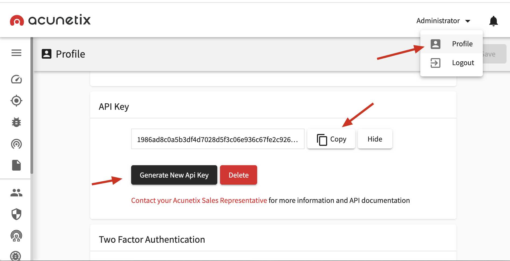
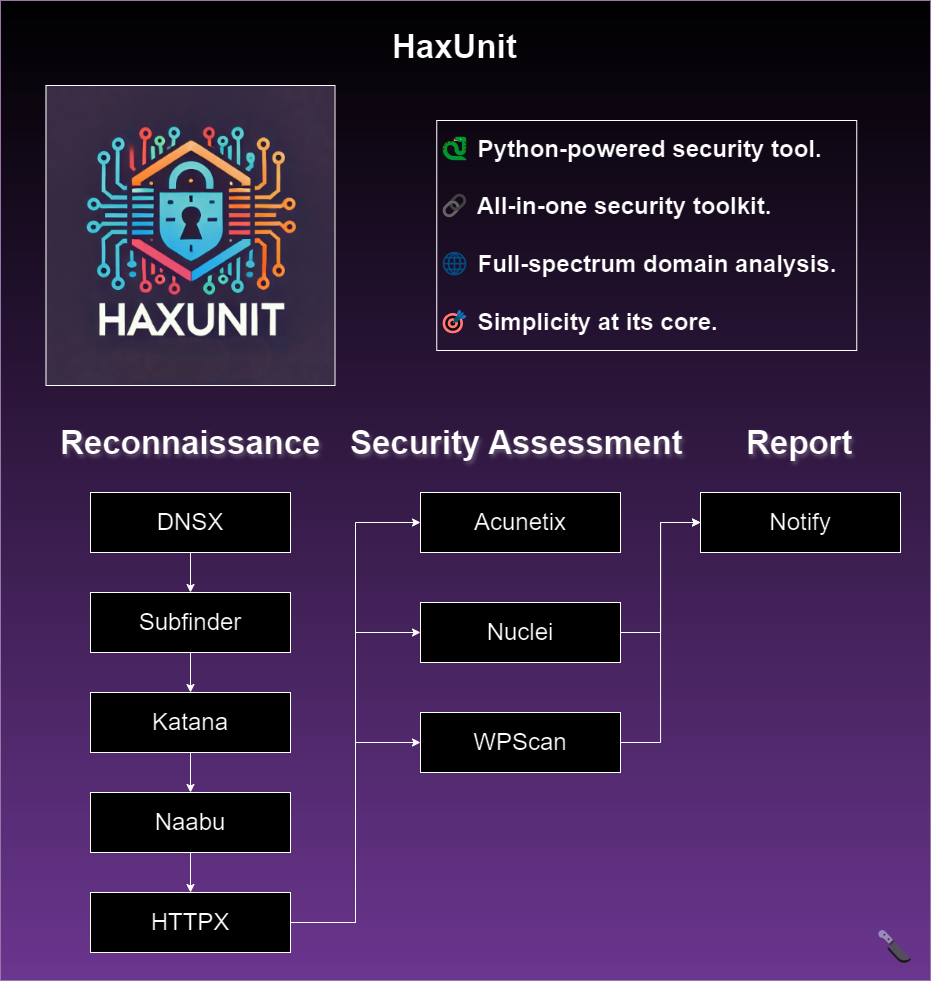

<h1 align="center">
  
  <br>
</h1>

<p align="center">
  <a href="#intro">Intro</a> •
  <a href="#installation">Installation</a> •
  <a href="#usage">Usage</a> •
  <a href="#running-haxunit">Running HaxUnit</a> •
  <a href="#functions">Functions</a>
</p>

# Intro

HaxUnit is a Python script designed for comprehensive reconnaissance and security assessment of web domains. It integrates various tools for subdomain enumeration, port scanning, vulnerability scanning, and more.

## Features

- **Subdomain Enumeration**: Uses tools like Subfinder, DNSx, and custom bruteforce methods.
- **Port Scanning**: Utilizes Naabu for fast port scanning across discovered subdomains.
- **Vulnerability Scanning**: Integrates Nuclei for detecting security issues across web applications.
- **WordPress Scanning**: Uses WPScan to identify vulnerabilities in WordPress installations.
- **Acunetix Integration**: Provides optional integration with Acunetix for web application security scanning.

# Install HaxUnit

Make sure you have the following software installed on your system:

- `python3` (>=3.8)
- `go` (>=1.122) 
- `docker.io` (>=20.10.7)

Clone the repository, install Python requirements, and automatically install all necessary tools:
```commandline
git clone https://github.com/Bandit-HaxUnit/haxunit && cd haxunit
python3 -m pip install -r requirements.txt
python3 main.py --install
```

If everything is installed correctly you should see the following output:
```commandline
[HaxUnit] [Init] All tools are successfully installed - good luck!
```

<details>
  <summary>Docker</summary>

 For a reliable installation, it's recommended to use HaxUnit with Docker.
 
 This initial setup may take a few minutes:
 
 
 ```bash
 git clone https://github.com/Bandit-HaxUnit/haxunit && cd haxunit
 chmod +x rebuild.sh && ./rebuild.sh
 ```
 
 Once the installation completes successfully, you'll be inside the Docker container, ready to execute HaxUnit:
 
 ```
 [HaxUnit] Installation complete - you can start scanning now.
 root@hostname:/app# python3 main.py -d example.com
 ```
  
</details>

# Usage
```commandline
python3 main.py -h
```

This will display help for the tool. Here are all the switches it supports.

```commandline
usage: main.py [-h] [-d DOMAIN] [-m {quick,extensive}] [-v] [-b BIN] [-is ISERVER] [-it ITOKEN] [-acu ACUNETIX] [-y]
               [-u] [-i] [-ia] [-r RESOLVERS] [--wpscan-api-token WPSCAN_API_TOKEN]

options:
  -h, --help            show this help message and exit
  -d DOMAIN, --domain DOMAIN
                        the website to recon: example.com
  -m {quick,extensive}, --mode {quick,extensive}
                        set scan mode
  -v, --verbose         print more information
  -b BIN, --bin BIN     set which python bin to use
  -is ISERVER, --iserver ISERVER
                        interactsh server URL for self-hosted instance
  -it ITOKEN, --itoken ITOKEN
                        authentication token for self-hosted interactsh server
  -acu ACUNETIX, --acunetix ACUNETIX
                        Acunetix API key
  -y, --yes             yes to all
  -u, --update          update all tools
  -i, --install         install all tools
  -ia, --install_acunetix
                        install Acunetix
  -r RESOLVERS, --resolvers RESOLVERS
                        dnsx - list of resolvers to use (file or comma separated)
  --wpscan-api-token WPSCAN_API_TOKEN
                        The WPScan API Token to display vulnerability data
 ```

### Examples

Run a quick scan on `example.com`:
```commandline
python3 main.py -d example.com
```

Run a quick scan on `example.com` saying yes to adding domains by default:
```commandline
python3 main.py -d example.com -y
```

Run an extensive scan on `example.com` providing the Acunetix API key and WPScan API token:
```commandline
python3 main.py -d example.com -m extensive -acu <acunetix-api-key> --wpscan-api-token <wpscan-api-token> 
```

### Viewing Results

Results from the scan will be saved in the following directory structure:

```markdown
scans/
└── example.com/
    └── timestamp/
```

Replace `example.com` with your target domain and `timestamp` with the date and time when the scan was conducted. 
This structure organizes scan results chronologically under the respective domain folder within the scans directory.


# Post Installation Instructions

## subfinder
Subfinder will work after using the installation instructions however to configure Subfinder to work with certain services, you will need to have setup API keys.</br>
<a href="https://github.com/projectdiscovery/subfinder#post-installation-instructions">More info</a>

## wpscan
The WPScan CLI tool uses the WordPress Vulnerability Database API to retrieve WordPress vulnerability data in real time.</br>

For WPScan to retrieve the vulnerability data an API token must be supplied via the `--wpscan-api-token` parameter.</br>

You can also set it as environment variable in  by renaming `.env.example` to `.env` and filling in your API key.</br>
```WPSCAN_API_KEY=```

An API token can be obtained by registering an account on <a href="https://wpscan.com/register">WPScan.com</a>.


# Acunetix

HaxUnit utilizes Acunetix's REST API to automate group creation and initiate scans.</br>

To generate an API key, visit [https://localhost:3443/#/profile](https://localhost:3443/#/profile).

Pass the obtained API key to `-acu` parameter as follows:

```commandline
python3 main.py -d example.com -acu <acunetix-api-key>
```

You can also set it as environment variable in `.env`</br>
```ACUNETIX_API_KEY=```

<h1 align="center">
  
  <br>
</h1>


<details>
  <summary>Installing Acunetix</summary>

 To install Acunetix, execute the following command:

```commandline
python3 main.py --install_acunetix
```

This will download and install the Acunetix container. </br>
Once the installation is complete, you can start using Acunetix with HaxUnit.

Acunetix can be accessed at https://localhost:3443. <br>Use the following default credentials to log in:
```commandline
Username: vhae04@gmail.com
Password: Vhae@04
```
  
</details>

# Functions

| Function          | Type                            | Description                                                                                           |
|-------------------|---------------------------------|-------------------------------------------------------------------------------------------------------|
| dnsx_subdomains   | Subdomain discovery             | Use dnsx to find subdomains and brute force subdomains                                                |
| subfinder         | Subdomain discovery             | Use subfinder to find subdomains                                                                      |
| gau_unfurl        | Subdomain discovery             | Gather all URL's on the list of subdomains and parse the domain using unfurl                          |
| ripgen            | Subdomain discovery             | Generate and test subdomain permutations                                                              |
 | dnsx_ips          | Get IP addresses                | Use dnsx to fetch A records                                                                           |
| naabu             | Port scan + Subdomain discovery | Run naabu on the list of subdomains using list of common ports to discover HTTP services              |
| httpx             | Subdomain list validation       | Check all found subdomains if they are active                                                         |
| wpscan            | Vulnerability discovery         | WordPress Security Scanner                                                                            |
| acunetix          | Vulnerability discovery         | Automatically creates a group for the site and starts scans of the subdomains to find vulnerabilities |
| nuclei            | Vulnerability discovery         | Uses all found active subdomains to search for vulnerabilities                                        |

# Workflow
<h1 align="center">
  </a>
  <br>
</h1>

# Credits
Special thanks to the team at https://github.com/projectdiscovery for their incredible range of tools.